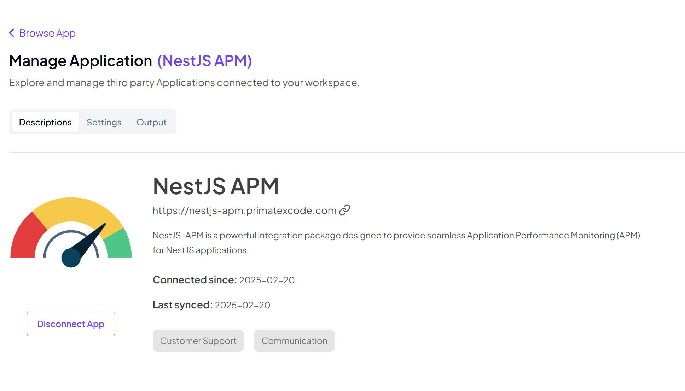
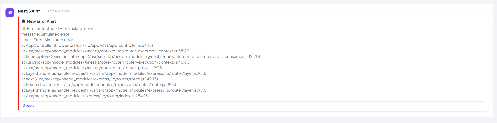
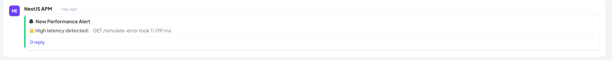

# NestJS APM (Application Performance Monitoring)

## Overview

NestJS APM is a monitoring solution integrated with Telex to track application performance and provide insights into request handling, errors, and system metrics for NestJS applications.



## Features

- Automatic request and response logging
- Error tracking and tracing
- Performance monitoring (latency, throughput, etc.)
- Custom transaction and span tracking
- Integration with Telex for real-time monitoring

## Prerequisites

- [Node.js](https://nodejs.org/) (>=16.x)
- [NestJS](https://nestjs.com/) framework
- [Telex](https://telex.im) for real-time monitoring
- Docker & Docker Compose (if deploying with containers)

## Installation

1. Clone the repository:

   ```sh
   git clone https://github.com/telexintegrations/nestjs-apm.git
   cd nestjs-apm
   ```

2. Install dependencies:

   ```sh
   npm install
   ```

3. Copy the environment file and update configurations:

   ```sh
   touch .env
   ```

   Modify `.env` with your APM server details:

   ```env
   TELEX_WEBHOOK_URL=https://your-telex-webhook-url
   ```

## Running the Application

### Development Mode

```sh
npm run start:dev
```

### Production Mode

```sh
npm run build
npm run start:prod
```

### Running with Docker

1. Build and start the container:

   ```sh
   docker-compose up -d --build
   ```

2. Check running logs:

   ```sh
   docker logs -f server
   ```

## API Endpoints

| Method | Endpoint            | Description                              |
| ------ | ------------------- | ---------------------------------------- |
| GET    | `/integration-json` | The Integration Json Data                |
| GET    | `/simulate-error`   | Simulate an error to test error tracking |
| GET    | `/simulate-slow`    | Simulate a slow request to test latency  |

## Integration JSON

The integration JSON file defined at the route /integration-json defines all the details needed for this integration to work on Telex.

```bash
GET /integration-json
```

## Error Tracking

To simulate an error, you can use the following endpoint:

```bash
GET /simulate-error
```



## Latency Testing

To simulate a slow request, you can use the following endpoint:

```bash
GET /simulate-slow
```



## Worker Threading

This project uses worker threads to handle long-running tasks.

- sending errors to telex
- sending latency to telex

## Testing

To run tests, use the following command:

```bash
npm run test
```

also for end to end testing

```bash
npm run test:e2e
```

## Logging & Monitoring

NestJS APM uses the following:

- [Exception Filter](https://docs.nestjs.com/exception-filters)
- [Logger](https://docs.nestjs.com/techniques/logger)
- [PromClient](https://www.npmjs.com/package/prom-client)
- [Telex](https://www.telex.im)

## Contributing

1. Fork the repository
2. Create a new feature branch (`git checkout -b feature-branch`)
3. Commit your changes (`git commit -m 'Add new feature'`)
4. Push to the branch (`git push origin feature-branch`)
5. Create a Pull Request

## License

This project is licensed under the MIT License.
